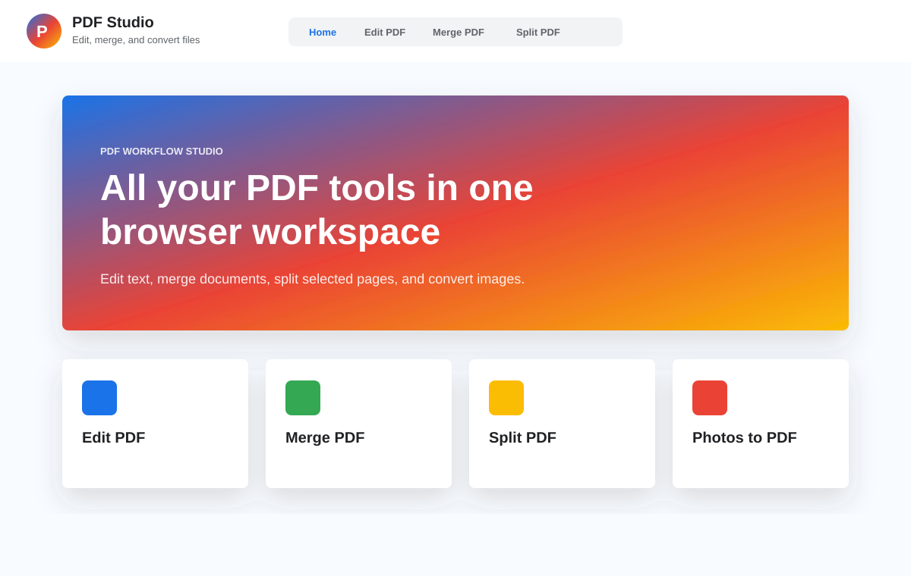
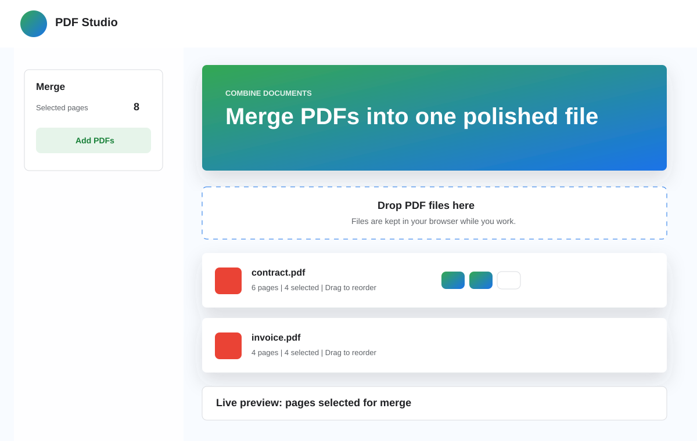
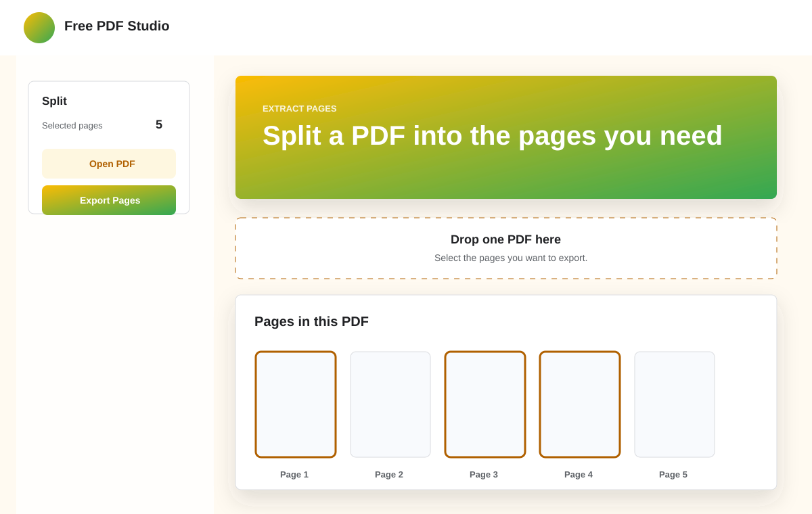

# Free PDF Studio

Free PDF Studio is a browser-based PDF utility website for editing, merging, splitting, and converting documents. It is built as a static frontend app with HTML, CSS, JavaScript, PDF.js, and pdf-lib.

## Features

- Edit selectable PDF text directly on rendered pages
- Reset or remove loaded files from each tool
- Automatically reset tool workspaces after downloading output files
- Merge multiple PDFs into one file
- Select pages before merging
- Drag and drop PDF files and selected pages to reorder output
- Preview selected merge pages before export
- Split a PDF by selecting pages
- Convert JPG and PNG photos to PDF
- Drag and drop photos to reorder pages
- Home, About, and professional footer sections
- Demo login UI with email and social sign-in buttons
- Google-style theme gradients per section

## Tech Stack

- HTML5
- CSS3
- JavaScript ES modules
- [PDF.js](https://mozilla.github.io/pdf.js/) for PDF rendering and text extraction
- [pdf-lib](https://pdf-lib.js.org/) for PDF editing, merging, splitting, and generation

## Project Structure

```text
.
├── assets
│   └── screenshots
│       ├── home.svg
│       ├── merge.svg
│       └── split.svg
├── index.html
├── README.md
└── src
    ├── app.js
    └── styles.css
```

## Screenshots

### Home



### Merge PDF



### Split PDF



## Run Locally

From the project folder:

```bash
python3 -m http.server 5173
```

Then open:

```text
http://127.0.0.1:5173/
```

Use a local server instead of opening `index.html` directly, because the app uses JavaScript modules and CDN imports.

## GitHub Pages Deployment

This project is static, so it can be deployed with GitHub Pages.

1. Push the project to GitHub.
2. Open the repository settings.
3. Go to `Pages`.
4. Select `Deploy from a branch`.
5. Choose the `main` branch and `/root` folder.
6. Save.

Your site will be available at:

```text
https://YOUR_USERNAME.github.io/YOUR_REPOSITORY_NAME/
```

## Login Note

The current login feature is a frontend demo. It stores a local browser session using `localStorage`.

For real Google, Facebook, or GitHub login, connect a provider such as Firebase Authentication and replace the demo sign-in handlers with real OAuth authentication.

## Limitations

- Text editing works best on PDFs with selectable text.
- Scanned/image-only PDFs need OCR before their text can be edited.
- The app currently uses CDN dependencies, so internet access is required when loading the page.

## License

This project is available for personal and educational use.
